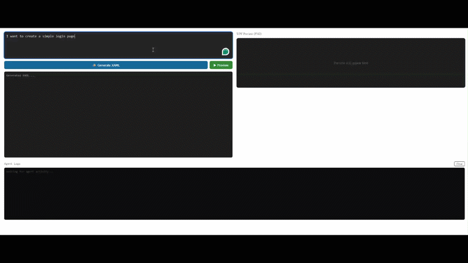

# XAML Designer Agent

A multi-agent AI system that generates, refines, and validates WPF XAML markup from natural language descriptions — with live PNG preview via a companion WPF renderer process.


---

<!-- Demo GIF: place an animated GIF at docs/screenshots/demo.gif and it will show here -->

<p align="center">
  
</p>

## Overview

XAML Designer Agent runs a three-stage AI pipeline that turns a plain English UI description into renderable WPF XAML — and shows you a live PNG preview of the result.

```
User prompt
    │
    ▼
┌─────────┐     JSON plan    ┌─────────┐     XAML      ┌──────────┐
│ Planner │ ───────────────► │ Builder │ ───────────►  │ Verifier │
└─────────┘                  └─────────┘               └──────────┘
                                                             │
                                                    corrected XAML
                                                             │
                                                             ▼
                                                    ┌───────────────┐
                                                    │ XamlRenderer  │  ← separate WPF process
                                                    │ (HTTP :5099)  │
                                                    └───────────────┘
                                                             │
                                                          PNG
                                                             │
                                                             ▼
                                                    Blazor preview pane
```

### Agent roles

| Agent | Responsibility | Recommended model |
|---|---|---|
| **Planner** | Converts natural language → structured JSON UI spec | `openrouter/owl-alpha` |
| **Builder** | Generates clean WPF XAML from the spec | `moonshotai/kimi-k2.6:free` |
| **Verifier** | Validates, finds issues, returns corrected XAML | `openai/gpt-oss-20b:free` |

All three agents use **OpenRouter free-tier models** — no paid API required.

---

## Features

- **Natural language → XAML** in one click
- **Update mode** — describe a change and the pipeline edits existing XAML
- **Live PNG preview** via a companion WPF renderer (no browser WPF runtime needed)
- **Agent tool calling** — agents call `GetComponentLibrary`, `GetLayoutSnippet`, `ValidateXamlSyntax`, `FormatXaml` to improve output quality
- **Real-time agent logs** streamed to the UI as each step executes
- **Auto fix loop** — Verifier retries up to N times, passing previous issues back in each pass
- **Renderer constraints enforced** — Sanitizer strips `x:Class`, `{Binding}`, event handlers, and custom namespaces before preview

---

## Architecture

Two projects, one solution:

```
XamlDesignerAgent.sln
├── XamlDesignerAgent/          Blazor Server (net10.0)
│   ├── AI/
│   │   ├── Services/
│   │   │   ├── AgentsOrchestrator.cs
│   │   │   ├── PlannerAgent.cs
│   │   │   ├── DesignerAgent.cs
│   │   │   └── ReviewAgent.cs
│   │   ├── Tools/
│   │   │   ├── PlannerTools.cs     GetComponentLibrary, GetLayoutSnippet
│   │   │   └── BuilderTools.cs     GetBindingSyntax, ValidateXamlSyntax, FormatXaml
│   │   └── Models/
│   │       ├── PipelineResult.cs
│   │       └── AiVerifyResponse.cs
│   ├── Components/
│   │   ├── Pages/Home.razor
│   │   ├── XamlPreview.razor       Displays PNG from renderer
│   │   └── AgentLogs.razor         Real-time streaming log panel
│   ├── Services/
│   │   ├── XamlRenderService.cs    HTTP client → XamlRenderer
│   │   └── AgentLogService.cs      In-process pub/sub log bus
│   └── Program.cs
│
└── XamlRenderer/               WPF WinExe (net9.0-windows, UseWPF=true)
    ├── App.xaml.cs             HttpListener on :5099
    └── MainWindow.xaml.cs      XamlReader.Parse() + RenderTargetBitmap
```

### Why two projects?

`XamlReader.Parse()` and `RenderTargetBitmap` require a live WPF `Application` on an STA thread, which is incompatible with ASP.NET Core. The renderer runs as a separate `WinExe` process and exposes three HTTP endpoints:

| Endpoint | Method | Purpose |
|---|---|---|
| `/health` | GET | Liveness check |
| `/render` | POST | XAML → PNG (base64) |
| `/validate` | POST | XAML → parse error or `"valid"` |
| `/format` | POST | XAML → indented XAML |

---

## Getting Started

### Prerequisites

- [.NET 10 SDK](https://dotnet.microsoft.com/download) or later
- Windows (required for the WPF renderer project)
- An [OpenRouter](https://openrouter.ai) API key (free tier is sufficient)

### Installation

```bash
git clone https://github.com/yourusername/XamlDesignerAgent.git
cd XamlDesignerAgent
```

Configure your API key via user secrets:

```bash
cd XamlDesignerAgent
dotnet user-secrets init
dotnet user-secrets set "AI:BaseUrl" "https://openrouter.ai/api/v1"
dotnet user-secrets set "AI:Key"     "sk-or-v1-your-key-here"
```

Build the solution:

```bash
dotnet build
```

### Running

**Option A — Visual Studio (recommended for development)**

Right-click the solution → Configure Startup Projects → set both projects to **Start**. Press F5.

**Option B — Command line**

```bash
# Terminal 1 — start the WPF renderer first
dotnet run --project XamlRenderer

# Terminal 2 — start the Blazor app
dotnet run --project XamlDesignerAgent
```

Open your browser at `https://localhost:7263`.

> The Blazor app also attempts to auto-launch `XamlRenderer.exe` on startup and waits up to 15 seconds for it to come online.

---

## Usage

### Generate new XAML

1. Type a UI description in the prompt box
2. Click **✨ Generate XAML**
3. Watch the **Agent Logs** panel as each agent runs
4. Click **▶ Preview** to render the output

### Update existing XAML

1. After generating XAML, type a change description in the **Update** box
2. Click **✏️ Update** — the pipeline runs in update mode, preserving unchanged elements

### Example prompts

```
Create a login form with username, password, and a Sign In button
```
```
Design a settings page with a category list on the left and settings panel on the right
```
```
Add a Remember Me checkbox below the password field
```
```
Change the layout to a dark theme with a sidebar navigation
```

---

## Configuration

Configuration is loaded from appsettings.json, environment variables, or dotnet user-secrets. See API_CONFIGURATION.md and the included `.env.example` for recommended setup and safety guidance.

Key configuration areas:

- AI: BaseUrl, Key
- Renderer: Url
- Models: Designer, Planner, Reviewer, Fallbacks

Example (appsettings.json):

```json
{
  "AI": {
    "BaseUrl": "https://openrouter.ai/api/v1",
    "Key": ""
  },
  "Renderer": {
    "Url": "http://localhost:5099"
  },
  "Models": {
    "Designer": "poolside/laguna-m.1:free",
    "Planner": "openrouter/owl-alpha",
    "Reviewer": "openrouter/owl-alpha",
    "Fallbacks": [ "openai/gpt-oss-20b:free", "openai/gpt-oss-120b:free" ]
  }
}
```

> Never commit real API keys. Use `dotnet user-secrets` or environment variables. See `API_CONFIGURATION.md` and `.env.example` for examples.

### Recommended free models on OpenRouter

| Role | Model ID | Notes |
|---|---|---|
| Planner | `openrouter/owl-alpha` | Good at structured JSON output |
| Builder | `moonshotai/kimi-k2.6:free` | Strong UI code generation, 262K ctx |
| Verifier | `openai/gpt-oss-20b:free` | Fast, good at finding mistakes |
| Fallback | `openai/gpt-oss-120b:free` | Use when smaller models fail |

Free tier limits: ~20 req/min, 200 req/day per model.

---

## XAML Renderer Constraints

Generated XAML must satisfy these constraints for `XamlReader.Parse()` to succeed:

| Rule | Why |
|---|---|
| Root must be `<Window>` | `XamlReader` expects a known root type |
| No `x:Class` | No code-behind exists in the renderer |
| No `{Binding ...}` | No ViewModel is attached |
| No `{StaticResource}` unless defined inline | No merged dictionaries loaded |
| No `Click=`, `Command=`, event attributes | No event routing available |
| No custom `xmlns` (`local`, `vm`, `d`, `mc`) | No assemblies loaded |
| Hardcoded sample values everywhere | Renderer displays data as-is |

A sanitizer in `DesignerAgent.cs` automatically strips violations before the XAML reaches the renderer.

---

## Troubleshooting

**Connection refused on localhost:5099**
- Make sure `XamlRenderer` is running
- On some Windows setups, `HttpListener` requires a URL ACL reservation:
  ```bash
  netsh http add urlacl url=http://localhost:5099/ user=Everyone
  ```

**Timeout errors from agents**
- Free models can be slow (60–180s). Timeouts are set to 2–3 minutes per agent.
- Disable SDK retries — the default 4-retry policy multiplies the wait time by 4.
- Try a faster fallback model (`openai/gpt-oss-20b:free`).

**`'<' is an invalid start of a value`**
- OpenRouter returned an HTML error page instead of JSON.
- Check your API key, and ensure `HTTP-Referer` header is set on requests.
- The free tier may be rate-limiting — wait and retry.

**XAML parse errors in preview**
- The Verifier auto-corrects most issues over up to 3 retry passes.
- Check the Agent Logs panel for which issues remain.
- Common culprits: `{Binding}`, `x:Class`, undefined `StaticResource` keys.

---

## Testing

Unit tests cover the core agent logic and tools:

```bash
dotnet test
```

**Test project:** `XamlDesignerAgent.Tests/`

| Test Class | Coverage |
|---|---|
| `PlannerToolsTests` | Component library (all + filtered), layout snippet fetching |
| `BuilderToolsTests` | XAML validation (valid/invalid/offline), formatting, binding syntax generation |
| `AgentsOrchestratorTests` | Pipeline retry logic, error handling, step limits |

**Tested scenarios:**
- ✅ Valid XAML → passes validation
- ✅ Invalid XAML (parse errors) → detected and reported
- ✅ Renderer offline → handled gracefully
- ✅ Retry loop → stops on valid, retries on issues, respects max steps
- ✅ Exceptions → caught and logged, user sees error message

Run tests locally before pushing:
```bash
cd XamlDesignerAgent.Tests
dotnet test --verbosity normal
```

---

## How agent tool calling works

Each agent has access to tools it can invoke during its reasoning loop:

**Planner tools**
- `GetComponentLibrary(category?)` — returns available WPF controls grouped by type
- `GetLayoutSnippet(screenType)` — returns a layout specification for common screen patterns

**Builder tools**
- `GetBindingSyntax(scenario)` — returns correct hardcoded XAML snippets (no bindings)
- `ValidateXamlSyntax(xaml)` — calls `/validate` on the renderer; returns parse errors with line numbers
- `FormatXaml(xaml)` — calls `/format` on the renderer; returns indented XAML

The Builder's self-validation loop means it can detect and fix its own parse errors before the output reaches the Verifier.

---

## Acknowledgements

- [Microsoft.Extensions.AI](https://github.com/dotnet/extensions) — agent framework
- [Microsoft.Agents](https://github.com/microsoft/agents) — `ChatClientAgent` and tool invocation
- [OpenRouter](https://openrouter.ai) — free-tier model access
- WPF / .NET for `XamlReader` and `RenderTargetBitmap` rendering